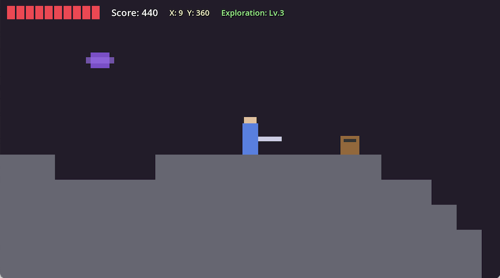

# gd-spelunker

A Godot 4.2+ procedurally generated 2D side-scrolling platformer focused on cave exploration and survival.

## Gameplay & Mechanics

### Exploration
The world is infinitely generated in chunks using Perlin noise. Players earn points by reaching new "grid exploration levels" (every 100x100 tile area reached from the starting point). 
- **Surface**: Colorful skies with grassy hills and parallax mountains.
- **Underground**: Maze-like tunnel systems, stone layers, and dark cave backgrounds with stalactites/stalagmites.
- **Water**: Pools found both on the surface and in deep caverns, featuring unique swimming physics.

### Combat & Health
- **Player Health**: Starts with 10 hearts. Damage causes a flinch and temporary invincibility.
- **Enemies**: 
  - **Walker**: Standard ground enemy that turns at edges.
  - **Bouncer**: Bouncing movement pattern.
  - **Thrower**: Launches projectiles in an arc.
  - **Flyer**: Horizontal aerial movement with a wobble.
- **Sword**: Directional swinging mechanics (Side, Up, Down). Killing enemies often drops heart pickups.

### Controls
| Key | Action |
|-----|--------|
| **A / D** | Move Left / Right |
| **M** | Jump / Double-Jump / Swim Up |
| **N** | Attack (Side) |
| **W + N** | Attack Upward |
| **S + N** | Attack Downward (Airborne) |
| **R** | Restart Game (Debug) |
| **F11** | Toggle Fullscreen |

## Technical Implementation

### Project Structure
- `project.godot`: Main configuration and input mappings.
- `scenes/`: Game scenes including player, enemies, and UI.
- `scripts/`: GDScript logic (Game Manager, Terrain, Player, AI).
- `resources/`: Tileset and visual resources.

### Key Systems
- **Procedural Generation (`terrain_generator.gd`)**: 
  - Uses `FastNoiseLite` for heightmaps and ridged noise for maze-like tunnels.
  - Implements a chunk-based loading system to handle infinite exploration efficiently.
  - Dynamic tilemap generation with physics layers for terrain and water.
- **Parallax Manager**: 
  - Manages multiple layers for sky, mountains, and trees.
  - Automatically toggles between overground and underground themes based on the player's depth.
- **Player Controller**: 
  - Features a state-machine approach for walking, wall-sliding, swimming, and attacking.
  - SMB-style swimming physics where Jump (M) provides a stroke and W+M at the surface allows jumping out.

## Visuals
The game currently utilizes high-contrast placeholder geometry (ColorRects) and procedurally generated textures for tiles. This ensures a functional prototype that is ready for asset integration.
